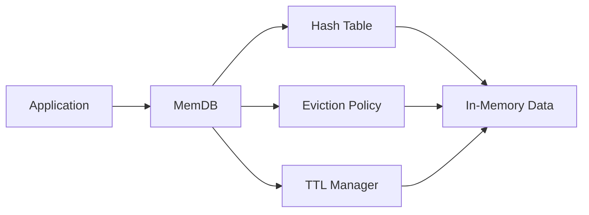

# MemDB
> Lightweight In-Memory Key-Value Cache

*MemDB* is a lightweight in-memory key-value cache designed to provide
fast access to frequently used data while efficiently managing limited
memory. The project focuses on understanding the internal working of a
cache through the implementation of fundamental data structures and
cache management techniques.

## Working

MemDB receives key-value operations from an application and stores the
corresponding data in memory. A hash table is used for fast key-based
lookup, while linked lists handle collisions. When the available cache
capacity is limited, eviction policies determine which entries should be
removed. TTL-based expiration allows entries to be automatically removed
after a specified period.

## Implementation

The cache provides basic operations such as `SET`, `GET`, `DELETE`, and
`CLEAR`. The implementation uses a hash table with linked-list collision
handling for efficient lookup. LRU and FIFO are used as cache eviction
strategies, while a min-heap can be used to manage TTL-based expiration.

The project combines C and C++ to separate low-level data structure
implementation from higher-level cache management. C is used for core
data structures and memory handling, while C++ is used for classes,
encapsulation, and cache policies.

## Performance Evaluation

MemDB will be evaluated using controlled workloads to measure cache hit
and miss rates, operation latency, eviction behaviour, and memory usage.
These measurements will help analyse the behaviour of different cache
policies and data-access patterns.

## Current Status

The project is currently in the architecture and design stage. The next
stage focuses on implementing the core data structures and basic cache
operations, followed by eviction, expiration, testing, and benchmarking.

## Implementation

The cache provides basic operations such as `SET`, `GET`, `DELETE`, and
`CLEAR`. The implementation uses a hash table with linked-list collision
handling for efficient lookup. LRU and FIFO are used as cache eviction
strategies, while a min-heap can be used to manage TTL-based expiration.

The project combines C and C++ to separate low-level data structure
implementation from higher-level cache management. C is used for core
data structures and memory handling, while C++ is used for classes,
encapsulation, and cache policies.

## Performance Evaluation

MemDB will be evaluated using controlled workloads to measure cache hit
and miss rates, operation latency, eviction behaviour, and memory usage.
These measurements will help analyse the behaviour of different cache
policies and data-access patterns.

## Current Status

The project is currently in the architecture and design stage. The next
stage focuses on implementing the core data structures and basic cache
operations, followed by eviction, expiration, testing, and benchmarking.

---

<em>
Keep it in memory. Keep it fast.
</em>

